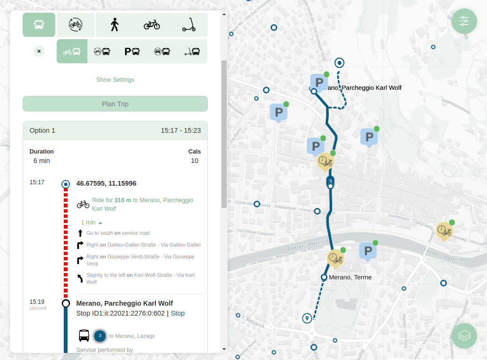

<!--
SPDX-FileCopyrightText: NOI Techpark <digital@noi.bz.it>

SPDX-License-Identifier: CC0-1.0
-->

# Mentor

This project contains automation for building an [OpenTripPlanner](http://opentripplanner.org) container image that includes OSM and GTFS data for South Tyrol.

[](https://github.com/noi-techpark/odh-docs/wiki/REUSE#badges)
[](https://github.com/noi-techpark/odh-mentor-otp/actions/workflows/ci.yml)

## Table of contents

- [Gettings started](#getting-started)
  - [Prerequisites](#prerequisites)
  - [Source code](#source-code)
  - [Docker environment](#docker)
- [Information](#information)



## Getting started

### Prerequisites

To build the project, the following prerequisites must be met:

- Docker
- Docker-compose

If you want to run the application using [Docker](https://www.docker.com/), the environment is already set up with all dependencies for you. You only have to install [Docker](https://www.docker.com/) and [Docker Compose](https://docs.docker.com/compose/)

### Source code

Get a copy of the repository:

```bash
git clone https://github.com/noi-techpark/odh-mentor-otp.git
```

Change directory:

```bash
cd odh-mentor-otp
```

#### Scripts and sub folders

```router-config.json``` define OTP updaters(GTFS-RT) and router settings from environment vars

```build-config.json``` OTP build config that includes which sources (GTFS, OSM) constitutes the graph

```south-tyrol.geojson``` the geographic extend that is extracted and processed by OTP

```journey/``` static javascript client side react/redux UI component to interact with OpenTripPlanner instance.

```gbfs/``` service that fetch bikesharing data from ODH and provide them as GBFS for otp.

```gtfs2bbox/``` nodejs tool to calculate bounding boxes of Openstreetmap intersects GTFS data for downloading, create a list of overpass downloadable urls

```geocoder/``` nodejs simplified implementation of Pelias Geocoder

### Docker Environment

In each service directory the file `.env.example` list the default env vars by service.
Below is a list of env variables for each container:

##### otp

```JAVA_TOOL_OPTIONS``` the JVM configuration of OpenTripPlanner, for example `JAVA_TOOL_OPTIONS=-Xmx6G`.

##### build

in addition to those of *otp* vars

```BUILD_GRAPH``` if *True* force the re/construction of the roads graph starting from the data: osm, gtfs, srtm. Generate a new *Graph.obj* file in the path ```/opt/odh-mentor-otp/openmove/Graph.obj```

```DOWNLOAD_DATA``` if *True* download openstreetmap and terrain model data around the gtfs file

```BACKUP_GRAPH``` if *True* create also a backup copy for each new graph in path */opt/odh-mentor-otp/Graph.obj.%y-%m-%d.tgz*

```UPDATERS``` if *True* create the router-config.json with GBFS/GTFS-RT updaters

```GBFS_HOST``` host path to GBFS service

```GBFS_VERSION``` gbfs version 1 or 2.1 (rebuild graph is required)

```GTFS_URL``` gtfs source ftp uri of gtfs .zip file to download

```GTFS_URL_UPDATETIME``` gtfs source time interval in cronjob style (i.e. `*/30 * * * *` for every 30 minutes)

```GTFS_URL_UPDATEHOOK``` url hook to restart build service

```GTFS_FILE``` the name of gtfs zip file to auto download Openstreetmap data

```GTFS_RT_URL``` gtfs-realtime url with trip updates (rebuild graph is required)

```GTFS_FEED_ID``` gtfs feed id which the gtfs-rt refers to. This is the defined by the  'feed_id' value (unofficial) inside feed_info.txt, if not defined this should be "1" (rebuild graph is required)

```OTP_OFFICIAL``` if *True* will use the OpenTripPlanner Official Version, otherwise the IBI-Group Version [(see Compatibility)](#compatibility)

```CARSHARING_HOST``` host path to Carsharing service

```PARKING_HOST``` host path to parking service

```CHARGER_HOST``` host path to charger service


#### geocoder

```API_HOST``` deployed hostname of OpenTripPlanner api default: ```localhost``` (name of deployed)

```API_PATH``` aboslute url path ```/otp/routers/openmove```

```API_PORT``` port default ```8080``` (port of internal service otp)

```HERE_APPID``` here geocoder api appId params

```HERE_APPCODE``` here geocoder api appCode params

### Building Arguments

Below is a list of Docker args variables for each container:

#### otp, builder

```OTP_VERSION``` version of OpenTripPlanner binary downloaded from official repos, default is 1.4.0

#### journey

```API_HOST``` deployed hostname of OpenTripPlanner api default: ```localhost``` (name of deployed)

```API_PATH``` aboslute url path ```/otp/routers/openmove```

```API_PORT``` port default ```8080``` (port of internal service otp)

```GEOCODER_BASEURL``` default pelias geoder instance http://localhost/geocoder/v1

```PARKING_BASEURL``` host path to Parking to show in map

```CHARGER_BASEURL``` host path to Charger stationsto show in map

```GOOGLE_ANALYTICS_ID``` google analytics tracking code UA-XXXXX-Y

Then you can start the application using the following command:

## Running OTP

If you don't want to build the graph yourself, you can simply run the following to start OTP

```
docker run -it -p 8080:8080 ghcr.io/noi-techpark/odh-mentor-otp/odh-mentor-otp:df65ce3c8656f4431cb89d79df6b2cc1db4d7cc9
```

You can find the latest version of the image on its [repository page](https://github.com/noi-techpark/odh-mentor-otp/pkgs/container/odh-mentor-otp%2Fodh-mentor-otp).

## Building a graph

If you want to build graph on your local machine there are convenience scripts available that
download the requisites and builds the graph.

```
./build-graph.sh
./run-otp.sh
```

## Information

### Guidelines

Find [here](https://opendatahub.readthedocs.io/en/latest/guidelines.html) guidelines for developers.

### Support

ToDo: For support, please contact [info@opendatahub.com](mailto:info@opendatahub.com).

### Contributing

If you'd like to contribute, please follow the following instructions:

- Fork the repository.

- Checkout a topic branch from the `development` branch.

- Make sure the tests are passing.

- Create a pull request against the `development` branch.

A more detailed description can be found here: [https://github.com/noi-techpark/documentation/blob/master/contributors.md](https://github.com/noi-techpark/documentation/blob/master/contributors.md).

### Documentation

More documentation can be found at [https://opendatahub.readthedocs.io/en/latest/index.html](https://opendatahub.readthedocs.io/en/latest/index.html).

### Boilerplate

The project uses this boilerplate: [https://github.com/noi-techpark/java-boilerplate](https://github.com/noi-techpark/java-boilerplate).

### REUSE

This project is [REUSE](https://reuse.software) compliant, more information about the usage of REUSE in NOI Techpark repositories can be found [here](https://github.com/noi-techpark/odh-docs/wiki/Guidelines-for-developers-and-licenses#guidelines-for-contributors-and-new-developers).

Since the CI for this project checks for REUSE compliance you might find it useful to use a pre-commit hook checking for REUSE compliance locally. The [pre-commit-config](.pre-commit-config.yaml) file in the repository root is already configured to check for REUSE compliance with help of the [pre-commit](https://pre-commit.com) tool.

Install the tool by running:
```bash
pip install pre-commit
```
Then install the pre-commit hook via the config file by running:
```bash
pre-commit install
```
